#############
API Reference
#############

This part of the documentation describes each function, class, and method in
detail.

***************
Class structure
***************

The chart below is a `class diagram
<https://en.wikipedia.org/wiki/Class_diagram>`_. It shows the inheritance and
composition relationships between the classes. For example, :py:class:`Ptycho`
is an :py:class:`Operator` which is composed of :py:class:`Convolution` and
:py:class:`Propagation` (which are also Operators).

.. The class diagram is manually rendered using mermaidjs and saved as an svg
   the sphinxcontrib-mermaid package is out of date and doesn't work (21.3.2020)

*******
Modules
*******

operators
=========
.. automodule:: tike.operators
   :inherited-members:
   :members:
   :show-inheritance:
   :undoc-members:

opt
===
.. automodule:: tike.opt
   :inherited-members:
   :members:
   :show-inheritance:
   :undoc-members:

ptycho
======

.. automodule:: tike.ptycho
   :inherited-members:
   :members:
   :show-inheritance:
   :undoc-members:

.. automodule:: tike.ptycho.ptycho
   :inherited-members:
   :members:
   :show-inheritance:
   :undoc-members:

.. automodule:: tike.ptycho.solvers
   :inherited-members:
   :members:
   :show-inheritance:
   :undoc-members:

tomo
====
.. automodule:: tike.tomo
   :inherited-members:
   :members:
   :show-inheritance:
   :undoc-members:

.. automodule:: tike.tomo.tomo
   :inherited-members:
   :members:
   :show-inheritance:
   :undoc-members:

.. automodule:: tike.tomo.solvers
   :inherited-members:
   :members:
   :show-inheritance:
   :undoc-members:

view
====
.. automodule:: tike.view
   :inherited-members:
   :members:
   :show-inheritance:
   :undoc-members:
