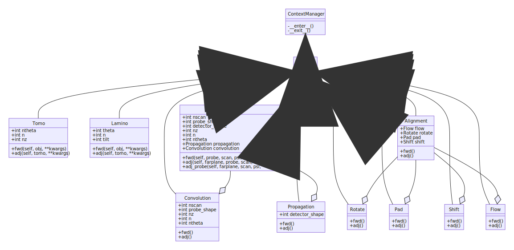

#############
API Reference
#############

This part of the documentation explains the code structure and describes each
function, class, and method in detail.

************
Key Concepts
************
The key concepts of the Tike code structure are the following:

 1. Solvers are based on forward and adjoint operators

 2. Solvers are organized into modules based on problem-type

Solvers share fundamental operators
===================================

An operator is a transforms data from one space to another. For example, the
tomography forward operator is the radon transform; it maps a 2D Cartesian
space to the sinogram space. The adjoint operator maps data from sinogram space
back to 2D Cartesian.

Solutions to inverse problems may be formulated in terms of forward and adjoint
operations. This formulation is not only familiar to mathematicians, but we
also avoid code duplication by reusing same forward and adjoint operators for
all approaches to solving a given inverse problem.

Modules by problem type
=======================
The solvers for each problem-type (ptychography, tomography, etc) are separated
into modules of their respective names.

************************
Operator class structure
************************

Forward and adjoint operations in Tike are implemented as a Python class called
Operator. This allows a natural linking of the forward and adjoint methods and
for Operators to be composed of other Operators.

The chart below is a `class diagram
<https://en.wikipedia.org/wiki/Class_diagram>`_. It shows the inheritance and
composition relationships between the Operators in. For example,
:py:class:`Ptycho` is an :py:class:`Operator` which is composed of
:py:class:`Convolution` and :py:class:`Propagation` (which are also Operators).

.. The class diagram is manually rendered using mermaidjs and saved as an svg
   the sphinxcontrib-mermaid package is out of date and doesn't work (21.3.2020)

*******
Modules
*******

The modules in Tike are as follows:

.. toctree::
   :maxdepth: 1

   operators
   align
   cluster
   communicators
   constants
   lamino
   linalg
   opt
   precision
   ptycho
   random
   scan
   trajectory
   view
